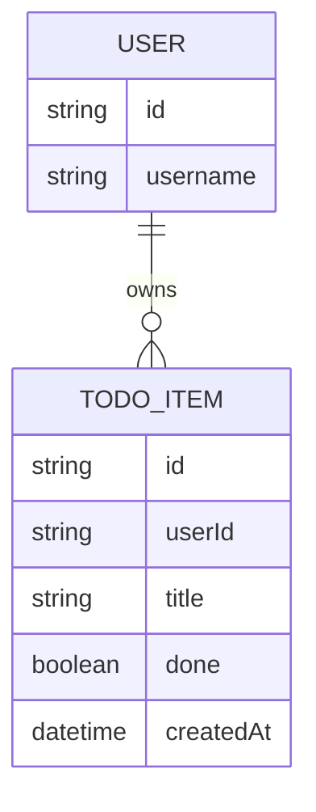

# Domain Model

The domain is small: each signed-in user owns a private list of todo items.

`USER` is not stored by this system — it is the identity Thunder asserts on
every request (the `sub` claim). `TODO_ITEM` is the one entity `todo-api`
owns, always scoped to the caller's own `userId`.